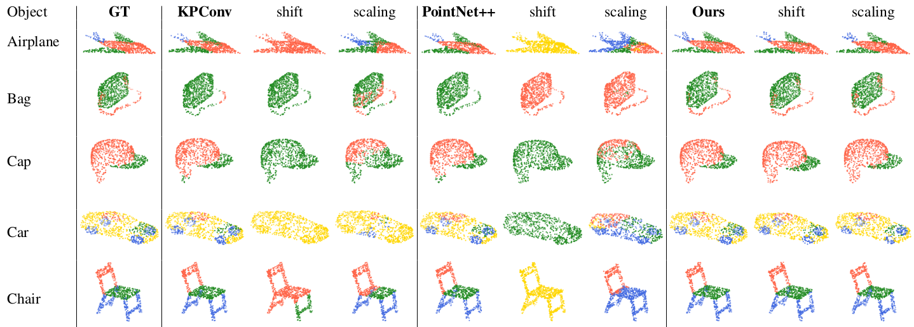

# Segmentation on ShapeNetPart


Model structure for segmentation

## Dataset
ShapeNet is used in segmentation task, more detail information about this datasset can be found on this [official website](https://www.shapenet.org/). To download the dataset, please run: 
```
bash download.sh
```
the resulting dataset is `shapenetcore_partanno_segmentation_benchmark_v0/`. 

## Hyper-parameters
Descriptions of all hyper parameters are shown by running:
```
python3 main.py -h
```
Default values are speciifed in `main.py`.

## Training 
To train GCN3D, please **add/remove/edit** hyper parameters in `train.sh` (e.g. dataset for `-dataset` argument), and run: 
```
bash train.sh
```

## Testing
After training, please **add/remove/edit** hyper parameters in `test.sh`, and run the evaluation:
```
bash test.sh
```
which would show the mIoU (average over *all categories / all instances / each category* ) on testing set.

## Notifications
When testing, object transformation can be added by editing `-shift`, `-scale`, `-rotate`, `-random`. Compared with pervious works, 3D-GCN is **shift- and scale-invariant** and less sensitive to rotation, which is much more robust.

## Visualization
When trianing and testing, visualization images for segmentation results can be generated by adding argument `-output`. Some visualization examples are as below:


