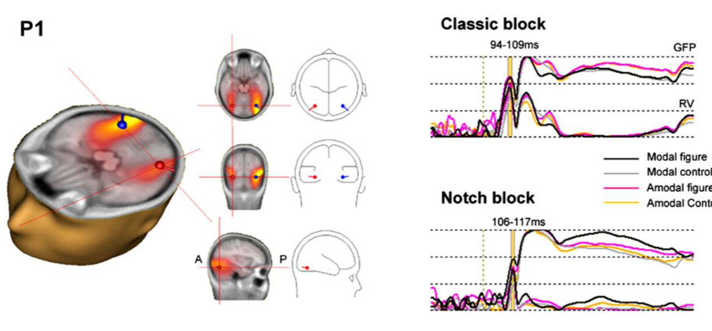
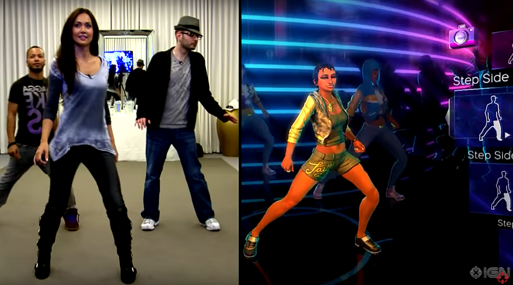
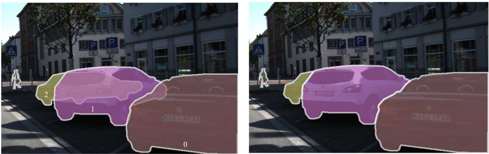
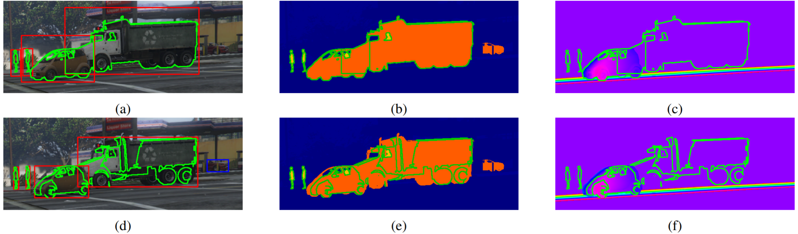
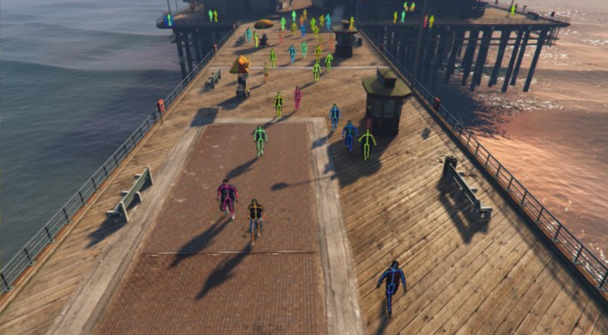
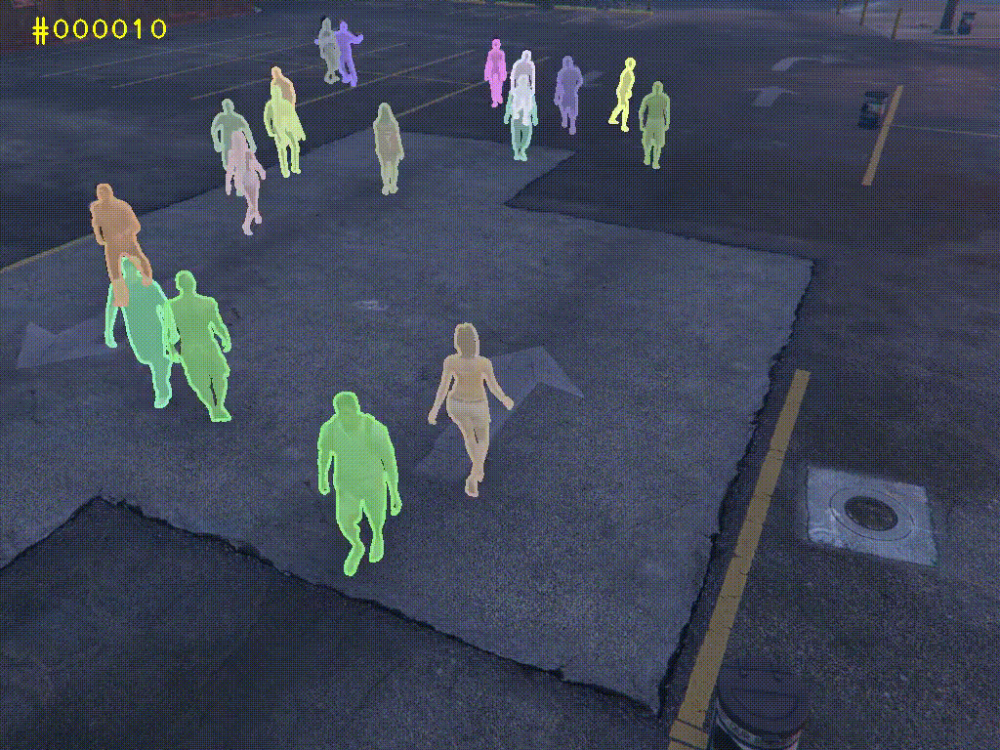
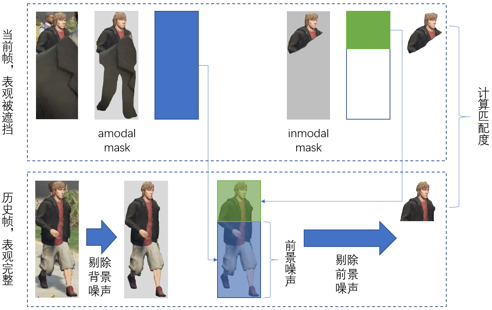
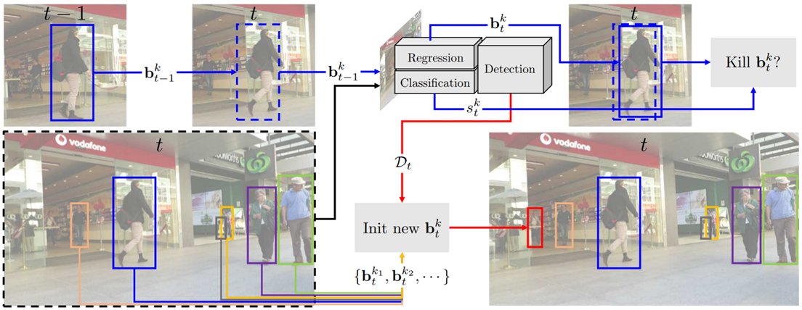

# Amodal Multiple Object Tracking and Segmentation

[TOC]

## Introduction

Amodal perception是人类的重要感知能力。可以简单理解为，人类可以“脑补”被部分遮挡物体的完整轮廓。

在计算机视觉中，amodal perception 也有重要意义。比如在自动驾驶中，即使人是被部分遮挡的，也应该判断出他的完整轮廓，从而降低发生碰撞的风险。

现在已经有工作致力于令机器学习算法具备 amodal perception 的能力，然而仅基于图像——输入是一个物体不完整的表观，输出是该物体的完整mask（即 amodal mask）。这么做的缺陷是，仅依赖静态图像，无特定于目标的信息，只能依赖训练数据的先验进行预测。因此有必要提出视频amodal数据集，可通过相邻帧获得特定于目标的信息，更有利于amodal mask的预测。

然而，由于标注工作的困难巨大，目前没有 video amodal 的相关研究。因此本文利用GTA5游戏，自动生成 video amodal 数据集，填补了 video amodal 领域的空白。

为了探索 video amodal 的作用，我们提出了两个新任务：Amodal Multiple Object Segmentation (AMOS) 和 Amodal Multiple Object Tracking and Segmentation (AMOTS)。其中 AMOTS = MOT + AMOTS。

实验预期可以证明，借助 amodal perception，不仅能够实现 AMOS/AMOTS 新任务，而且对传统的 MOT 任务的性能提升也有帮助。

## Related Work
### Amodal Perception 背景介绍
#### 人类的 Amodal Perception 

For example if we view two pencils crossed, one pencil occluding the other, the occluded pencil has a great gap of missing data, and yet we perceive that pencil as complete and continuous through the occlusion.

Amodal perception is a property of human perception.

The amodal image forms immediately and automatically based only on the appearance of the visible surfaces**, **assisted by my past experience.

The amodal percept is not the object itself, as suggested by naive perception, but rather, the amodal percept is a data structure constructed by our mind based on sensory evidence.

Amodal perception connects the world of direct experience to the world of imagination.

#### Amodal Perception 与神经科学的联系

#### Amodal Perception 在计算机视觉中的意义

Typical examples include enabling autonomous cars to infer the whole shape of vehicles and pedestrians within the range of vision, even if part of them is invisible, largely reducing the risk of collision. It, thus, makes the moving decision in complex traffic or living environment easier.

https://www.youtube.com/watch?v=Y-iKWe-U9bY 多人的人机交互场景中，就算人被遮挡了，也需要正确获取人物轮廓。

#### 图像的 Amodal Perception

##### [CVPR2019] Amodal Instance Segmentation with KINS Dataset

Amodal instance segmentation, a new direction of instance segmentation, aims to segment each object instance involving its invisible, occluded parts to imitate human ability.

> 左图：amodal mask。右图：inmodal mask。

##### 缺点

仅依赖静态图像，无历史经验，无法绝对正确的脑补。

#### 视频的 Amodal Perception

##### 必要性

只有借助历史信息，才能正确脑补。

##### 稀缺性

由于难以得到数据，所以目前没有这方面的研究。

### 虚拟数据生成背景介绍

#### GTA 5 游戏介绍

In this work, we explore the use of commercial video games for creating large-scale pixel-accurate ground truth data for training semantic segmentation systems. Modern open-world games such as Grand Theft Auto, Watch Dogs, and Hitman feature extensive and highly realistic worlds. Their realism is not only in the high fidelity of material appearance and light transport simulation. It is also in the content of the game worlds: the layout of objects and environments, the realistic textures, the motion of vehicles and autonomous characters, the presence of small objects that add detail, and the interaction between the player and the environment. The scale, appearance, and behavior of these game worlds are significant advantages over open-source sandboxes that lack this extensive content. However, detailed semantic annotation of images from off-the-shelf games is a challenge because the internal operation and content of the game are largely inaccessible. We show that this can be overcome by a technique known as detouring [19]. *(Playing for Data: Ground Truth from Computer Games)*

#### Playing for data: Ground truth from computer games [ECCV2016]

语义分割数据集。

Experiments on semantic segmentation datasets show that using the acquired data to supplement real-world images significantly increases accuracy and that the acquired data enables reducing the amount of hand-labeled real-world data: models trained with game data and just $\frac{1}{3}$ of the CamVid training set outperform models trained on the complete CamVid training set.

High-quality semantic labeling was reported to require 60 minutes per image for the CamVid dataset [8] and 90 minutes per image for the Cityscapes dataset [11].

We conducted extensive experiments to evaluate the effectiveness of models trained with the acquired data. The experimental results show that using the acquired data to supplement the CamVid and KITTI training sets significantly increases accuracy on the respective datasets. In addition, the experiments demonstrate that the acquired data can **reduce the need for expensive labeling of real-world images**: models trained with game data and just $\frac{1}{3}$ of the CamVid training set outperform models trained on the complete CamVid training set.

#### Driving in the Matrix: Can Virtual Worlds Replace Human-Generated Annotations for Real World Tasks?

We demonstrate that a state of the art architecture, which is **trained only using these synthetic annotations**, performs better than the identical architecture trained on human annotated real-world data, when tested on the KITTI data set for **vehicle detection**. By training machine learning algorithms on a rich virtual world, **real objects in real scenes can be learned and classified using synthetic data**. This approach offers the possibility of accelerating deep learning’s application to sensorbased classification problems like those that appear in selfdriving cars.

In particular, we focus on the task of **vehicle detection** within images.

In fact, this paper illustrates that current successful approaches to the vehicle detection task are based on **a handful of data sets** and a training process that leads to **poor cross data set performance**, which restricts real-world utility.

The contributions of this paper are as follows: 

- 1) a fully automated system to extract training data from a sophisticated simulation engine; 
- 2) experiments to address the issue of **data set bias** in deep learning-based object classification approaches, specifically in self-driving car data sets; 
- 3) **state-of-the-art performance on real data using simulation only training images**; 
- 4) results that highlight **improved performance with greater numbers of training images,** suggesting **the ceiling for training examples has not yet been reached for standard deep learning network architectures**.

> 游戏中直接给出的边框有误差。本文得到了更紧的边框。

#### Learning to Detect and Track Visible and Occluded Body Joints in a Virtual World

问题：没有mask。

## Method

本节内容分为三部分：amodal 视频数据生成、Amodal Multiple Object Segmentation (AMOS) 任务和 Amodal Multiple Object Tracking and Segmentation (AMOTS) 任务。在 AMOTS 任务中，借助于 amodal perception，我们提出了“前景噪声”概念，对传统的 MOT 任务性能提升也有帮助。

### Amodal 视频数据生成

我们生成的视频能得到每个人的bbox，人物id，完整mask。

TODO：必须要保存遮挡关系。

### Amodal Multiple Object Segmentation

#### 任务定义

给定每帧的检测框和id，预测完整mask。

#### 任务意义

仅依据图像，难以正确预测被遮挡mask。（无前后帧表观）

该任务利用时间信息（即前后帧的表观），致力于得到更精确的 amodal mask。

#### 网络设计

输入是历史和当前表观，输出是当前的 amodal mask 和 inmodal mask。

具体可设计三种网络：

- （网络一）输入为：整幅图像，输出为：每个人的amodal/inmodal mask。(未利用时间信息，baseline)
- （网络二）输入为：某人在历史帧和当前帧的表观，输出为：该人的两种mask。(online)
- （网络三）输入为：某人在历史帧、当前帧、未来帧表观，输出：该人的为两种mask。(offline)

具体网络架构待定。

### Amodal Multiple Object Tracking and Segmentation

#### 任务定义

给定每帧的检测框，预测id和mask。

Amodal MOTS = MOT + Amodal Multiple Object Segmentation

#### 相似任务对比

| 任务                                                    | 输入                   | 输出                       |
| ------------------------------------------------------- | ---------------------- | -------------------------- |
| Single object tracking                                  | 第一帧的矩形框         | 每帧矩形框                 |
| Multiple object tracking                                | 每帧的所有检测         | 每个检测框的ID             |
| Video object segmentation（单目标）                     | 第一帧的分割           | 每帧的分割                 |
| Video instance segmentation (多目标）                   | 第一帧中每个物体的分割 | 每帧中每个物体的分割       |
| ReID                                                    | 每帧的所有检测和ID     | 不同视频中的ID对应         |
| Amodal multiple object segmentation (ours)              | 每帧的所有检测和ID     | 每个检测框的amodal分割     |
| Amodal multiple object tracking and segmentation (ours) | 每帧的所有检测         | 每个检测框的ID及amodal分割 |

#### 跟踪算法

##### 创新点

提出了前景噪声的概念。对部分出现的物体，当其与历史表观对比时，仅需对比该人显露出来的区域。我们用amodal/inmodal mask可以判断人体何处显露/隐藏，使得匹配得分更准。

##### 递进关系

- 边框：具有背景噪声。
- mask：具有前景噪声。
- amodal mask：消除了背景噪声和前景噪声。

##### Amodal 概念在跟踪的作用

- 判断表观完整性，当一个人被部分遮挡时，表观变得不完整，则不将其加入历史序列，避免引入噪声。
- 对于一个部分出现的人，根据两种mask判断被遮挡的位置，消除前景噪声。

##### 框架概述

训练基于图像的amodal分割，得到一个人的amodal mask+inmodal mask (coarse mask)，可判断该人是否被部分遮挡，以及何处被遮挡。

简单情况下，直接（利用网络一）回归。

跟踪中断的人，加入 inactive 序列。

对于部分遮挡的人，由于表观不完整，不将其加入历史库。

当有部分出现的人时，（利用网络一）得到amodal/inmodal mask，对历史中的表观进行背景噪声和前景噪声的消除，再计算匹配度。

采用历史帧和当前帧，（利用网络二）预测当前帧的 amodal mask (refine mask)。
