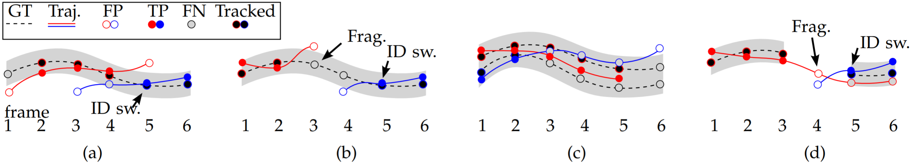

# MOT16: A Benchmark for Multi-Object Tracking

## Abstract

MOT16 provides multiple object classes beside pedestrians and the **level of visibility** for every single object of interest.

## 1 INTRODUCTION

## 2 ANNOTATION RULES

If a target reappears after a prolonged period such that its location is ambiguous during the occlusion,  it will reappear with a new ID.

## 3 Datasets

Obviously, we cannot (nor necessarily want to) prevent anyone from using a different set of detections,  or relying on a different set of features. However, we require that this is noted as part of the tracker’s description and is also displayed in the ratings table for transparency.

## 4 EVALUATION

什么是 public detection ? ~~是你的跟踪结果中的每个框，必须来自于公开检测集。~~**你可以对提供给你的框进行调整，但不能用检测器创造新的框。**

评价指标有：MOTA/(MOTP)/(IDF1)/MT/ML/FP/FN/IDsw。

| 评价指标 | 说明                                                         | 与ID的关系 |
| -------- | ------------------------------------------------------------ | ---------- |
| FP       | One hypothesized output is a false alarm.                    | 无关       |
| FN       | A target that is missed by any hypothesis.                   | 无关       |
| IDsw     | 对于一条GT轨迹，找到对应的预测框，计算这些预测框身份切换次数。 | 相关       |
| MOTA     | FN/FP/IDsw的综合。                                           | 相关       |
| MT       | A target is mostly tracked (MT) if it is successfully tracked for at least **80%** of its life span. | 无关       |
| ML       | If a track is only recovered for less than **20%** of its total length, it is said to be mostly lost (ML). | 无关       |

For the following, we assume that each ground truth trajectory has one unique start and one unique end  point, i.e. that it is not fragmented.

### 4.1.1 Tracker-to-target assignment

One is to determine **for each hypothesized output**, whether it is a true positive (**TP**) that describes an actual (annotated) target, or whether the output is a **false alarm** (or false positive, **FP**). This decision is typically made by thresholding based on a defined distance (or dissimilarity) measure $d$ (see  Sec. 4.1.2).

A target that is missed by any hypothesis is a false negative (**FN**).

As proposed in [41], the  optimal matching is found using Munkre’s (a.k.a. Hungarian) algorithm. However, dealing with video data, this matching is not performed independently for each frame, but rather considering a temporal correspondence. More precisely, if a ground truth object $i$ is matched to hypothesis $j$ at time $t − 1$ and the distance  (or dissimilarity) between $i$ and $j$ in frame $t$ is below  $t_{d}$, then the correspondence between $i$ and $j$ is carried over to frame $t$ even if there exists another hypothesis  that is closer to the actual target. A mismatch error (or equivalently an identity switch, **IDSW**) is counted if a ground truth target $i$ is matched to track $j$ and the **last known assignment** was $k \not= j$.

### 4.1.2 Distance measure

Similar to object detection [14], the **intersection over union** (a.k.a. the Jaccard index) is usually employed as the similarity criterion, while the threshold $t_{d}$ is set to 0.5 or 50%.

### 4.1.3 Target-like annotations

### 4.1.4 Multiple Object Tracking Accuracy

$$
\text{MOTA} = 1 - \frac{\sum_{t}(\text{FN}_{t} + \text{FP}_{t} + \text{IDSW}_{t})}{\sum_{t}\text{GT}_{t}},
$$

where $t$ is the frame index and GT is the number of ground truth objects.

Note that MOTA can also be negative in cases where the number of errors made by the tracker exceeds the number of all objects in the scene.

### 4.1.5 Multiple Object Tracking Precision

$$
\text{MOTP} = \frac{\sum_{t,i}d_{t,i}}{\sum_{t}c_{t}},
$$

where $c_{t}$ denotes the number of matches in frame $t$ and $d_{t,i}$ is the bounding box **overlap** of target $i$ with its assigned ground truth object.

MOTP thereby gives the average overlap between all **correctly matched hypotheses** and their respective objects and ranges between $t_{d} := 50\%$ and $100\%$.

对于正确的框，IoU 是多少。

### 4.1.6 Track quality measures

#### MT/PT/ML

Each **ground truth** trajectory can be classified as mostly tracked (**MT**), partially tracked (**PT**), and mostly lost (**ML**).

This is done based on how much of the trajectory is **recovered** by the tracking algorithm.

A target is mostly tracked if it is successfully tracked for at least **80%** of its life span.

Note that it is irrelevant for this measure **whether the ID remains the same** throughout the track.

If a track is only recovered for less than **20%** of its total length, it is said to be mostly lost (ML).

#### FM

In certain situations one might be interested in obtaining **long, persistent tracks** without gaps of untracked periods. To that end, the number of track fragmentations (**FM**) counts **how many times a ground truth trajectory is interrupted** (untracked).

In other words, a fragmentation is counted each time a trajectory changes its status from tracked to untracked and tracking of that **same trajectory** is resumed at a later point.

该图必须弄懂。

评价指标是评价的啥？不就是 ID 吗？