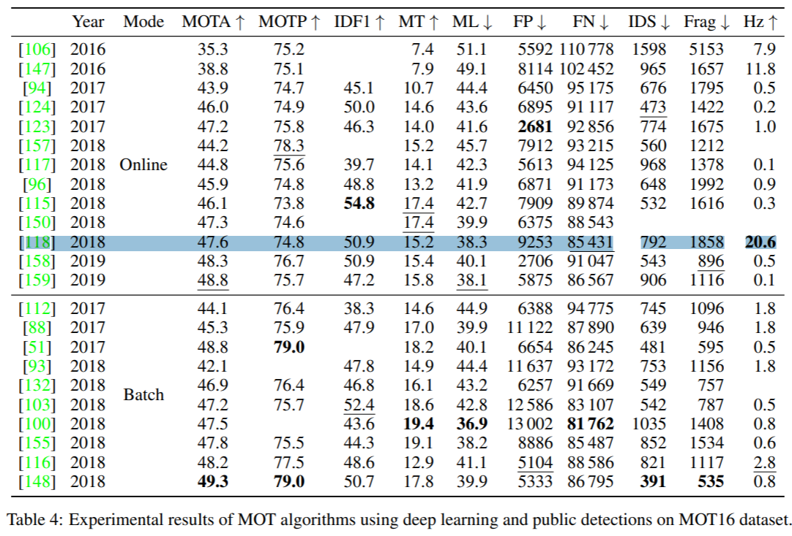
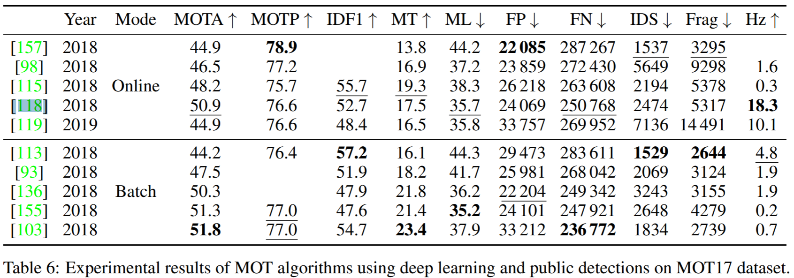

# REAL-TIME MULTIPLE PEOPLE TRACKING WITH DEEPLY LEARNED CANDIDATE SELECTION AND PERSON RE-IDENTIFICATION

ICME 2018，引用 59。

## 1. Introduction

Our contribution is three fold.

- First, we handle unreliable detection in online tracking  by **combining both detection and tracking results as candidates**, and selecting optimal candidates based on deep neural networks.
- Second, we present a hierarchical **data association strategy**, which utilizes spatial information and deeply learned person re-identification (ReID) features.
- Third, we demonstrate real-time and state-of-the-art performance of our  tracker on a widely used people tracking benchmark.

## 3. PROPOSED METHOD
### 3.1. Framework Overview
In this work, we extend traditional tracking-by-detection by collecting **candidates from outputs of both detection and tracks**.

Our framework consists of two sequential tasks, that is, **candidate selection** and **data association**.

- We first measure all the candidates using an unified scoring function.
  A discriminatively trained **object classifier** and  a well-designed **tracklet confidence** are fused to formulate the **scoring function**, as described in Section 3.2 and Section 3.3.
  Non-maximal suppression (NMS) is subsequently performed with the estimated scores.
- After obtaining candidates **without redundancy**, we use both **appearance representations** and **spatial information** to hierarchically **associate existing tracks with the selected candidates**.
  Our appearance representations are deeply learned from the person re-identification as described in Section 3.4.
  Hierarchical data association is detailed in Section 3.5.

### 3.2. Real-Time Object Classification

Combining **outputs of both detection and tracks** will result in an **excessive amount of candidates**.

### 3.3. Tracklet Confidence and Scoring Function

Given a new frame, we **estimate the new location of each existing track** using the Kalman filter.

### 3.4. Appearance Representation with ReID Features

### 3.5. Hierarchical Data Association

## Experiments

### 4.1 Experiment Setup

We form a **validation set with 5 video sequences from the training set** to analyze the contribution of
each component in our framework.

The training data for person classification is collected from MS COCO [17] and the **remaining two training video sequences**.

分类网络有什么意义？为什么别人问起的时候你语塞了？检测是有噪声的，需要打分。

回归方法的reid有没有finetune？ It should be noted that the reID network is indeed trained on tracking
ground truth data. 

回归方法训了什么？The core element of our tracking pipeline is a regressionbased detector. In our case, we train a Faster R-CNN [52] with ResNet-101 [22] and Feature Pyramid Networks (FPN) [41] on the **MOT17Det [45] pedestrian detection dataset**.

测试集是没有gt吗？是的。