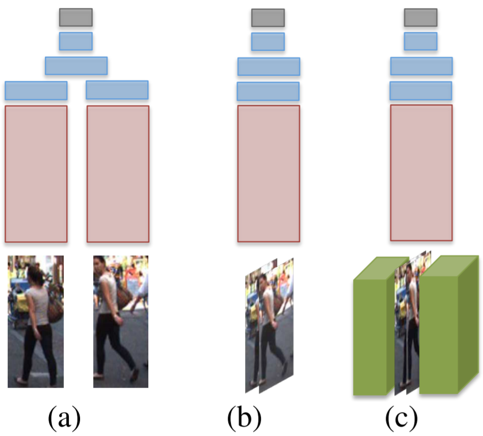

## Multiple People Tracking by Lifted Multicut and Person Re-identification

CVPR 2017

## Abstract

## 1. Introduction

## 2. Model

## 3. Person Re-identification for Tracking

In the context of multi-person tracking, linking the detected  pedestrians across the whole video can be viewed as reidentification with special challenges: **occlusions**, cluttered  background, large difference in image resolution and inaccurate bounding box localization.

### 3.1. Architectures

Next, we propose a **body part fusing** method to explicitly allow modeling the semantic body part information within the network.

### 3.2. Fusing Body Part Information

A desirable property of the network is to localize the corresponding regions of the body parts, and to reason about the similarity of a pair of pedestrian images based on the localized regions and the full images.

We stack the pair of images as well as the 14 score maps together  to form a 112×224×20 input volume.

Note that augmenting the network with body layout information can be interpreted as an **attention mechanism** that allows us to  focus on the relevant part on the input image. It can also be  seen as a mechanism to highlight the foreground and to enable the network to establish corresponding regions between input images.