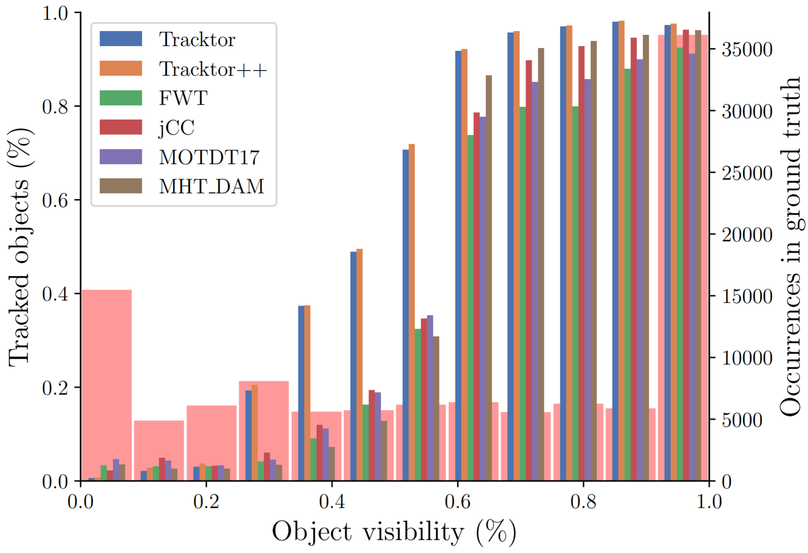
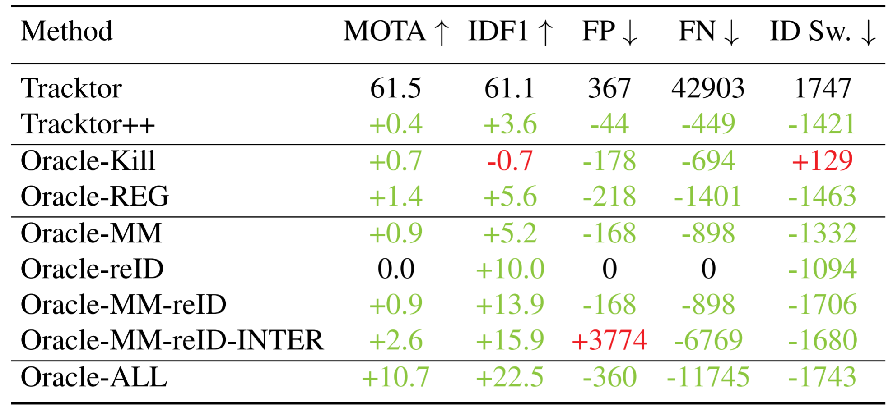

# Tracking without bells and whistles

## Abstract

ICCV 2019。

We present a tracker (without bells and whistles) that accomplishes tracking without specifically targeting any of these tasks, in particular, we perform **no training or optimization on tracking data**. 仅训练了检测数据库，未训练跟踪数据库。

## 2. A detector is all you need

### 2.1. Object detector

### 2.2. Tracktor

### 2.3. Tracking extensions

有两个扩展：运动模型和 reID 算法。

- 运动模型：CMC（camera motion compensation/相机运动补偿）。
- reID：使用孪生网络得到的表观向量计算距离。

## 3. Experiments

由上图可以看出，Trackror 的 ID Sw. 为 1747，Tracktor+reID 的ID Sw. 为 921，得到了大幅下降。值得注意的是，其他指标，包括 MOTA，是基本不变的，这说明改善了 ID Sw.，未必能改善其他指标。CMC 模块使得 ID Sw. 由 1747 下降到了 458，降幅更明显。

## 4. Analysis

The superior performance of our tracker without any tracking specific training or optimization demands a more thorough analysis. Without sophisticated tracking methods, it is **not expected to excel in crowded and occluded**,  but rather only in benevolent, tracking scenarios. Which begs the question whether more **common tracking methods fail to specifically address these complex scenarios** as well. Our experiments and the subsequent analysis ought to demonstrate the strengths of our approach for **easy tracking scenarios** and motivate future research to **focus on remaining complex tracking problems**.

The subsequent analysis is conducted on the **MOT17 training data** and we compare all top  performing methods with publicly shared data.

### 4.1. Tracking challenges

#### Object visibility

Intuitively, we expect diminished tracking performance for object-object or object-non-object occlusions, i.e., for targets with diminished visibility.

The **high MOTA values** in Table 2 are largely due to the **unbalanced distribution of ground  truth visibilities**.

> The transparent red bars indicate the **ground truth distribution of visibilities**.

#### Object size

#### Robustness to detections

### 4.2. Oracle trackers

We have shown that none of the dedicated tracking methods specifically targets challenging tracking scenarios,  i.e., **objects under heavy occlusions** or small objects.

To this end, we analyse our performance twofold: (i) the impact of the object detector on the killing policy and bounding box regression, (ii) identify performance **upper bounds** for potential extensions to our Tracktor.

If not mentioned otherwise, all other tracking aspects are handled by our **vanilla** Tracktor.

#### Detector oracles

To simulate a potentially perfect object detector, we introduce two oracles: 

- Oracle-Kill: Instead of killing with NMS or classification score we use ground truth information. Kill 掉一个框：（情况一）已经从上一帧回归得到当前帧的目标，对于当前帧的检测框，需要用 NMS 来 kill 掉已经跟踪到的框。（情况二）目标消失，导致从上一帧回归的得分很低。
- Oracle-REG: Instead of regression, we place the bounding boxes at their ground truth position. 基于回归的两种作用，有两种理解：一是，对每一帧，给定真实的边框，但是文章并没有写出这一点。二是不通过回归建立两帧之间的关系，但这样怎么进行 ID 的关联？

#### Extension oracles

- Oracle-MM: A motion model places each bounding box at the center of the ground truth in the next frame. 对于当前帧的一个框，给出了该框在下一帧的准确位置（中心点）。
- Oracle-reID: Re-identification is performed with ground truth identities. 需要进行 ReID 时，不使用 ReID 网络，直接找 ground truth。

问题：Oracle-ALL 的情况下，算法做了什么？答案是，算法进行的身份关联。