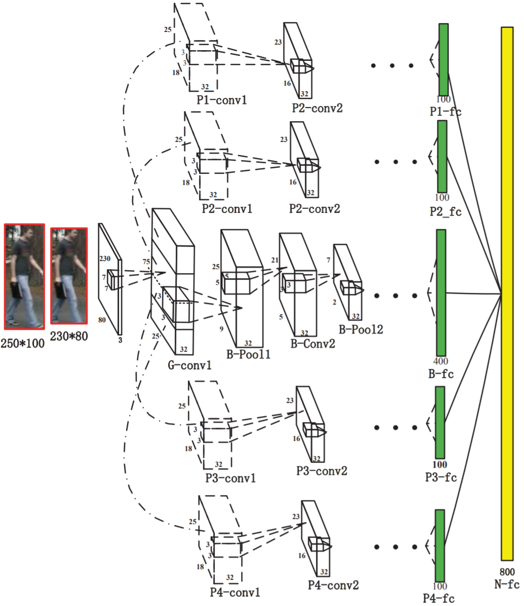

# Person Re-Identification by Multi-Channel Parts-Based CNN with Improved Triplet Loss Function

CVPR2016，引用 709。

## Abstract

In this paper,  we present a novel **multi-channel parts-based** convolutional neural network (CNN) model under the triplet framework for person re-identification.

## 1. Introduction

To extract better features for raw person images, we propose a new, multi-channel CNN model that learns features for both the input person’s **full body and the body parts**.

## 2. Related Work

## 3. The Proposed Person Re-Id Method

### 3.1. The Overall Framework

### 3.2. Multi-Channel Parts-based CNN Model

The proposed multi-channel CNN model mainly consists of the following distinct layers: one global convolution layer, one full-body convolution layer, **four body-part convolution layers**, five channel-wise full connection layers, and one network-wise full connection layer.

