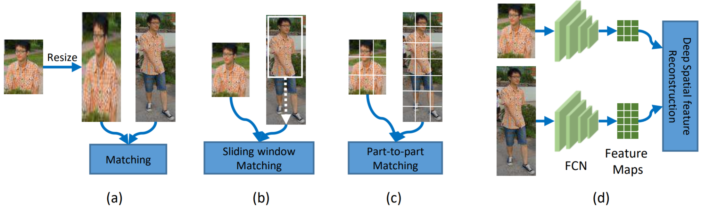

# Deep Spatial Feature Reconstruction for Partial Person Re-identification: Alignment-free Approach

CVPR2018，引用 50。

## Abstract

## 1. Introduction

部分遮挡解决方案

- To match an arbitrary patch of a person, some researchers resort to **re-scale an arbitrary patch of the person to a fixed-size image**.
  However, the performance would be significantly degraded due to the **undesired deformation** (see Fig. 2(a)).
- **Sliding Window Matching** (SWM) [32] indeed introduces a possible solution for partial person re-id by constructing a sliding window of the same size as the probe image and utilizing it to search for the most similar region within each gallery image (see Fig. 2(b)).
  However, SWM would not work well when the size of the probe person is bigger than the size of the gallery person.
- Some person re-id approaches further consider a **part-based model** which offers an alternative solution of partial person re-id in Fig. 2(c).
  However, their computational costs are extensive and they require **strict person alignment** beforehand.
  Apart from these limitations, both SWM and part-based models repeatedly extract sub-region features **without sharing intermediate computation results**, which lead to unsatisfactory computation efficiency.

## 2. Related Work

**Partial person re-id**

- To address this problem, many methods [3, 6] **warp an arbitrary patch of an image to a fixed-size image**, and then extract fixed-length feature vectors for matching. However, such method would **result in undesired deformation**.
- **Part-based models** are considered as a solution to partial person re-id. Patch-to-patch matching strategy is employed to handle occlusions and cases where the target is partially out of the camera’s view. Zheng et al. [32] proposed a local patch-level matching model called Ambiguity-sensitive Matching Classifier (AMC) based on **dictionary learning** with explicit patch ambiguity modeling, and introduced a global part-based matching model called Sliding Window Matching (SWM) that can provide complementary spatial layout information. However, the **computation cost** of AMC+SWM is rather extensive as features are calculated repeatedly without further acceleration.

**Partial face recognition**

- Liao et al. [12] proposed an alignment-free approach called multiple **keypoints** descriptor SRC (MKD-SRC), where multiple affine invsariant keypoints are extracted for facial features representation and sparse representation based classification (SRC) [22] is then used for recognition. However, the performance of keypoint-based methods is not quite satisfying with hand-crafted local descriptors.

## 3. The Proposed Approach

### 3.1. Fully Convolutional Network

由于删除了全连接层，所以输入尺寸可以是任意的。

### 3.2. Deep Spatial Feature Reconstruction

In this section, we will introduce how to measure the similarity between a pair of person images of **different sizes**.

$I$: a partial person.
$J$: a holistic person.
$\mathbf{x} = conv(I, \theta)$: $I$ 对应的特征，$\mathbf{x} \in \mathbb{R}^{w \times h \times d}$。
$\mathbf{y} = conv(J, \theta)$: $J$ 对应的特征。
$\mathbf{X} = \{\mathbf{x}_{1}, \cdots, \mathbf{x}_{N}\} \in \mathbb{R}^{d \times N}$: 把 $\mathbf{x}$ 的每个空间位置都划分成一个一维向量。
$\mathbf{x}_{n} \in \mathbb{R}^{d \times 1}$: $\mathbf{x}$ 的某个空间位置处的向量。
$n = 1, \cdots, N$: 表示 $\mathbf{x}$ 的空间位置的下标。
$N = w \times h$: $x$ 的空间位置数。
$\mathbf{Y} = \{\mathbf{y}_{1}, \cdots, \mathbf{y}_{M}\} \in \mathbb{R}^{d \times M}$: 把 $\mathbf{y}$ 的每个空间位置都划分成一个一维向量。

$\mathbf{x}_{n}$ can be represented by **linear combination** of $\mathbf{Y}$. That is to say, we attempt to **search similar blocks to reconstruct** $\mathbf{x}_{n}$. Therefore, we wish to solve for the **sparse coefficients** $\mathbf{w}_{n}$ of $\mathbf{x}_{n}$ with respect to $\mathbf{Y}$, where $\mathbf{w}_{n} \in \mathbb{R}^{M \times 1}$. Since **few blocks** of $\mathbf{Y}$ are **expected for reconstructing** $\mathbf{x}_{n}$, we constrain wn using $\ell_{1}$-norm. Then, the sparse representation formulation is defined as
$$
\min_{\mathbf{w}_{n}}||\mathbf{x}_{n} - \mathbf{Y}\mathbf{w}_{n}||_2^{2} + \beta||\mathbf{w}_{n}||_{1}. \tag{3}
$$
For $N$ blocks in $\mathbf{X}$, the **matching distance** can be defined as
$$
e = \frac{1}{N}||\mathbf{X} - \mathbf{YW}||_{F}^{2},
$$
where $\mathbf{W} = \{\mathbf{w}_{1},  \cdots, \mathbf{w}_{N}\} \in \mathbb{R}^{M \times N}$ is the **sparse reconstruction coefficient matrix**. The whole matching procedure is exactly **our proposed Deep Spatial feature Matching**  (DSR). As such, DSR can be used to **classify a probe partial person, which does not need additional person alignment**.

### 3.3. Fine-tuning on Pre-trained FCN with DSR

The loss function is
$$
\mathcal{L}_{veri}(\theta, \mathbf{W}) = \alpha||\mathbf{X} - \mathbf{YW}||_{F}^{2} + \beta||\mathbf{W}||_{1}.
$$
We employ an **alternating optimization** algorithm to optimize $\mathbf{W}$ and $θ$ in the objective $\mathcal{L}_{veri}$.

**Step 1: fix $θ$, optimize $W$.** The aim of this step is to solve sparse reconstruction coefficient matrix $\mathbf{W}$. For solving optimal $\mathbf{W}$, we solve $\mathbf{w}_{1}, \cdots, \mathbf{w}_{N}$ respectively, hence, equation (3) is further rewritten as
$$
\min_{\mathbf{w}_{n}}\frac{1}{2}\mathbf{w}_{n}^{T}\mathbf{Y}^{T}\mathbf{Y}\mathbf{w}_{n} - \mathbf{x}_{n}^{T}\mathbf{Y}\mathbf{w}_{n} + \beta||\mathbf{w}_{n}||_{1}.
$$
We utilize the **feature-sign search** algorithm adopted in [9] to solve an optimal $\mathbf{w}_{n}$.

Step 2: fix $\mathbf{w}_{c},$ optimize $\theta$. To update the parameters in
FCN, we then calculate the gradients of $\mathcal{L}_{veri}(\theta)$ with respect to  $\mathbf{X}$ and $\mathbf{Y}$
$$
\left\{\begin{array}{}
\frac{\partial\mathcal{L}_{veri}(\theta)}{\partial{\mathbf{X}}} = 2\alpha(\mathbf{X}-\mathbf{YW}) \\
\frac{\partial{\mathcal{L}_{veri}(\theta)}}{\partial\mathbf{Y}} = -2\alpha(\mathbf{X}-\mathbf{YW})\mathbf{W}^{T}.
\end{array}\right.
$$
