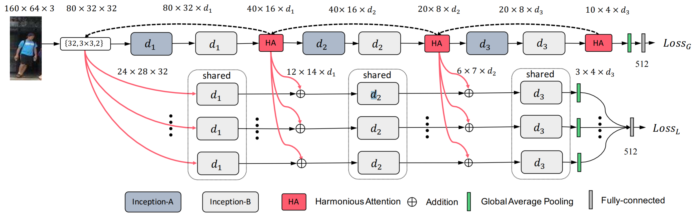

# Harmonious Attention Network for Person Re-Identification

CVPR 2018，引用 350。

## Abstract

In this work, we show the advantages of jointly learning **attention selection** and feature representation in a Convolutional Neural Network (CNN) by maximising the complementary information of different levels of visual attention subject to re-id discriminative learning constraints.

## 1. Introduction

There is consequently an inevitable need for attention selection within arbitrarily-aligned bounding boxes  as an integral part of model learning for re-id.

To our knowledge, this is the first attempt of jointly deep learning **multiple complementary attention** for solving the person reid problem.

## 2. Related Work

## 3. Harmonious Attention Network

This HA-CNN model contains two branches: 

- (1) One local branch (consisting of $T$ streams of an identical structure): Each stream aims to learn the most discriminative visual features for one of $T$ **local image regions** of a person bounding box image. 
- (2) One global branch: This aims to learn the optimal global level features
  from entire person images. For both branches, we select the Inception-A/B units [44, 32] as the basic building blocks