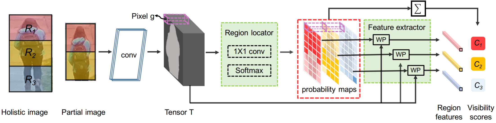

# Perceive Where to Focus: Learning Visibility-aware Part-level Features for Partial Person Re-identification

CVPR 2019. 引用 15.

## Abstract

Under partial re-ID scenario, the images may contain a partial observation of a pedestrian. If we directly compare a partial pedestrian image with a holistic one, the **extreme spatial misalignment** significantly compromises the discriminative ability of the learned representation.

## 1. Introduction

We propose a visibility-aware part model (VPM) for partial re-ID task. VPM learns to **locate the visible regions** on pedestrian images through **self-supervision**.

Given two images to be compared, VPM conducts a region-to-region **comparison within their shared regions**, and thus significantly suppresses the spatial misalignment as well as the distracting noises originated from unshared regions.

We conduct extensive partial re-ID experiments on both **synthetic datasets** and realistic datasets and validate the effectiveness of VPM.

## 2. Related work

Wei et al. [26], Kalayeh et al. [12] and Sun et al. [23] **extract several region parts**, with **pose estimation** [17, 27, 10, 18, 1], **human parsing** [2, 5] and **uniform partitioning**, respectively. Then they **learn a respective feature for each part** and assemble the **part-level features** to form the final descriptor. These progresses motivate us to extend learning part-level features to the specified problem of partial re-ID.

## 3. Proposed Method

### 3.1. Structure of VPM

**Input**

- a pedestrian image

**Output**

- a constant number of region-level features
- a set of visibility scores indicating which regions are visible on the input image

$p = m \times n$: densely aligned rectangle regions on the holistic pedestrian image through uniform division.
$R_{i}$: $p$ 个区域中的一个。
$H \times W$: **fixed size** of a partial pedestrian.
$T \in \mathbb{R}^{c \times h \times w}$: 3D tensor of the input image.
$g \in \mathbb{R}^{c}$: a pixel on $T$.

**A region locator** perceives which regions are visible and predicts their locations on tensor $T$. To this end, the region locator employs a $1 \times 1$convolutional layer and a following Softmax function to classify each pixel $g$ on $T$ into the **predefined regions**, which in formulated by,
$$
P(R_{i}|g) = softmax(W^{T}g) = \frac{expW_{i}^{T}g}{\sum \limits_{j=1}^{p}expW_{j}^{T}g},
$$
where $P(R_{i}|g)$ is the predicted probability of $g$ belonging to $R_{i}$.

The region locator also predicts the **visibility score** $C$ for each region, by accumulating $P(R_{i}|g)$ over all the $g$ on $T$, which is formulated by,
$$
C_{i} = \sum \limits_{g \in T} P(R_{i}|g).
$$
**A region feature extractor** generates a respective feature $f$ **for a region** by weighted pooling, which is formulated by,
$$
f_{i} = \frac{\sum \limits_{g \in T} P(R_{i}|g)g}{C_{i}}, \forall i \in \{1,2,...,p\}.
$$
### 3.2. Employing VPM

$I^{k}/I^{l}$: 两幅需要对比的图像。
$D_{i}^{kl} = ||f_{i}^{k} - f_{i}^{l}||, (i = 1,2,...,p)$: 图像 $I_{k}$ 和图像 $I_{l}$ 在区域 $R_{i}$ 的特征的欧氏距离。
$D^{kl} = \frac{\sum \limits_{i=1}^{p} C_{i}^{k}C_{i}^{l}D_{i}^{kl}}{\sum \limits_{i=1}^{p} C_{i}^{k}C_{i}^{l}}$: 图像 $I_{k}$ 和图像 $I_{l}$ 的基于局部特征的距离。

### 3.3. Training VPM

Training VPM consists of training the region classifier and training the region feature extractor.

Training VPM is *also* featured for employing auxiliary **self-supervision**.

Specifically, given a  holistic pedestrian image, we randomly crop a patch and resize it to $H × W$. 

To be concrete, let us assume a region with its up-left corner located at $(x_{1}, y_{1})$ and its bottom-right corner located at $(x_{2}, y_{2})$ on the input image.

Finally, we assign every pixel $g$ on $T$ with a region label $L(L \in 1, 2, \cdots, p)$ to indicate which region $g$ belongst o. We also record all the visible regions in a set $V$. As we will see, self-supervision contributes to training VPM in the following three aspects:

- First, self-supervision generates the ground truth of region labels for training the region locator.
- Second, self-supervision enables VPM to focus on visible regions when learning feature through classification loss (cross-entropy loss).
- Finally, self-supervision enables VPM to focus on the shared regions when learning features through triplet loss.

Without the auxiliary self-supervision, VPM encounters dramatic performance decrease, as to be accessed in Section 4.4.

**The region locator** is trained through **cross-entrompy loss** with the **self-supervision signal** $L$ as the ground truth, which is formulated by,
$$
L_{R} = - \sum \limits_{g \in T} \unicode{x1D7D9}_{i=L}log(P(R_{i}|g)),
$$
**The region feature extractor** is trained with the combination of **cross-entropy loss** and **triplet loss**.  We append a respective identity classifier i.e., $IP_{i}(f_{i})(i = 1, 2, \cdots, p)$ upon each region feature $f_{i}$, to predict the identity of training images. Then the cross-entropy loss is formulated by,
$$
L_{ID} = - \sum_{i \in V}\unicode{x1D7D9}_{k=y}log(softmax(IP_{i}(f_{i}))),
$$
where $k$ is the predicted identity and $y$ is the ground thuth.

The triplet loss pushes the features from a same pedestrian close to each other and pulls the features from different pedestrians far away. 