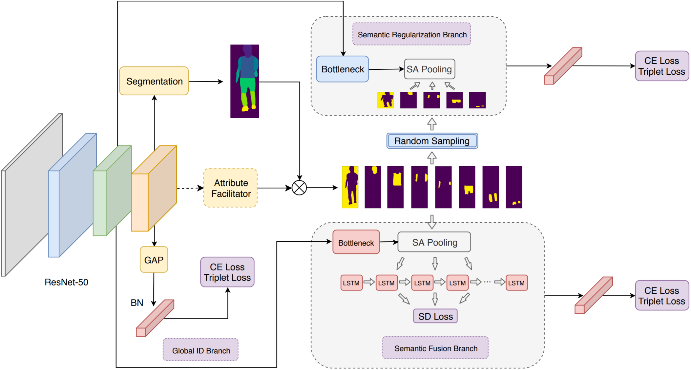

# MagnifierNet: Towards Semantic Regularization and Fusion for Person Re-identification

arXiv2002

## Abstract

Although person re-identification (ReID) has achieved significant improvement recently by **enforcing part alignment**, it is still a challenging task when it comes to distinguishing visually similar identities or identifying **occluded person**.

In these scenarios, **magnifying details in each part features** and selectively fusing them together may provide a feasible solution.

In this paper, we propose MagnifierNet, a novel network which accurately **mines details for each semantic region** and selectively **fuse all semantic feature representations**.

## 1. Introduction

ReID task is often challenged by huge human **pose variation**, **body occlusion** and  the **body part misalignment** problem under different camera views. Many algorithms have been proposed to tackle these problems via methods including **attention mechanism [26, 51], **body feature cropping** [50, 36] and **human parsing** [23] to **align person body** among images and improve accuracy.

However, as most of the previous approaches mainly focus on enhancing person feature alignment, how to accurately mine the fine-grained details in each semantic region and filter out the irrelevant noise from an input image still remain unaddressed.

## 2. Related Work 

### 2.1. ReID and Part Based Methods

Recently, researchers have intensively focused on **extracting local person features** to **enforce part alignment** and feature representation capability.

- For instance, Zhao et al. [50] proposed a **body region proposal network** which utilized **human landmark information** to compute **relative aligned part representation**. (CVPR2017)

- Zhao et al. [51] shared similar idea, but with feature representation generated from K part detectors. (ICCV2017)
- Sun et al. [36] proposed a Part-based Convolution Baseline (PCB) network which focuses on the consistency of uniform partition part-level feature with refined stripe pooling. (ECCV2018)
- Based on PCB, Multiple Granularity Network (MGN) [38] and Coarse-to-Fine Pyramidal Model(Pyramid) [52] explored multi-branch network to learn feature of different granularity, which attempted to incorporate global and local information. (MM2018/arXiv1810)

### 2.2. Semantic Assistance for ReID

- Xu et al.[45] resort to the assistance of predicted **keypoints confidence map** to extract aligned human parts representation.

- Similarly, Huang et al.[21] proposed **part-aligned pooling** based on delimited regions which shows significant improvement in cross-domain ReID task.
- Kalayel et  al. [23] adopts **predefined body regions** as supervision to drive the model to learn alignment representation in an automatic way.
- In [27], Lin et al. argued **human attributes** to be helpful information in ReID task. He has also provided the attribute annotation for two ReID datasets Market-1501 [53] and DukeMTMC-reID [35].

## 3. The Proposed Method

MagnifierNet consists of three main branches, namely the Semantic  Regularization Branch (SRB), the Semantic Fusion Branch  (SFB) and the Global Branch.

### 3.1. Semantic Aligned Pooling

To obtain semantic aligned representation, suppose each semantic label $L$ from the human segmentation model contains $S+1$ different regions, we denote them as $R_{1}, R_{2}, ..., R_{S}$ for each human semantic region and $R_{bg}$ for background region. 

The aligned semantic region can be represented by:
$$
X_{S}^{ID} = R_{S} \odot F,
$$
where $X_{s}^{ID}$ denotes the aligned binary representation of the $s^{th}$ semantic region and $R_{s}$ is the binary value of semantic region $R_{s}$ respectively. Therefore, the aligned ID feature can be represented as follows,
$$
X^{ID} = \sum_{s \subset S}X_{s}^{ID},
$$
where $S$ is the group of predefined semantic region(s) belonging to the same identity.

### 3.2. Semantic Regularization Branch

The feature map of an partially visible identity can be represented by
$$
X_{occluded}^{ID} = \sum_{i \subset \hat{S}}X_{s}^{ID}
$$
