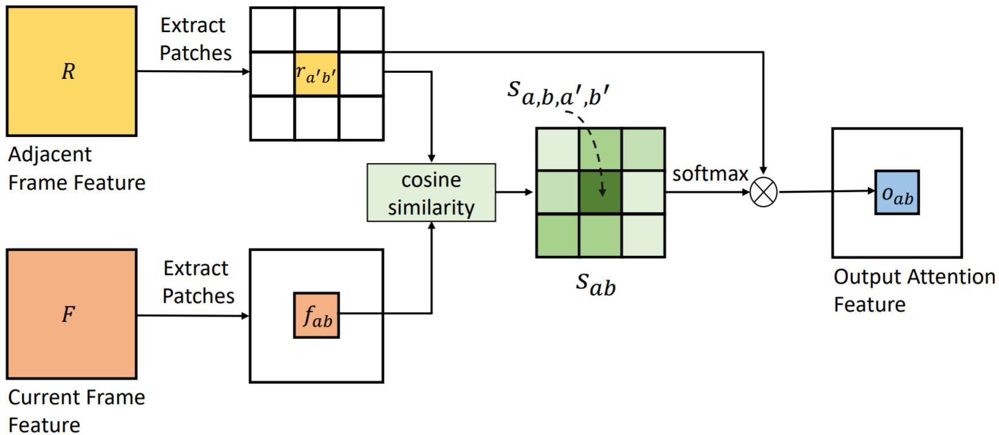

# VRSTC: Occlusion-Free Video Person Re-Identification

CVPR 2019，引用 11。

## Abstract

However, the performance of video re-ID degenerates severely under **partial occlusion**.

In this paper, we propose a novel network, called Spatio-Temporal Completion network (STCnet), to **explicitly handle partial occlusion problem**.

Different from most previous works that **discard the occluded frames**, STCnet can **recover the appearance of the occluded parts**.

## 1. Introduction

Video person re-identification (re-ID) aims at matching the same person across **multiple non-overlapping cameras**.

Typical video re-ID methods [21, 30, 32] **do not take into account the effect of partial occlusion**. They represent each frame of a video as a feature vector and **compute an aggregate representation across time** with average or maximum pooling.

In the presence of partial occlusion, the video feature is usually corrupted **due to the equal treatment** of all frames, leading to severe performance degeneration.

Recently, the **attention** mechanism has been introduced to video re-ID **in order to deal with partial occlusion** [18, 43, 33, 15, 3]. They **select discriminative frames from video sequences** and generate informative video representation.

Although these approaches **have a certain tolerance to partial occlusion**, it is **not ideal to discard the occluded frames**. On one hand, the remaining visible portions of  the discarded frames may provide strong cues for re-ID.  So these methods lost too much appearance information in  video features, making them difficult to identify the person.  On the other hand, the discarded frames **interrupt the temporal information of video**. The works [21, 30, 32] have verified that the temporal information of video can help to identify the person. For instance, if different persons have  similar appearance, we can disambiguate them from their gaits. Therefore, these methods may still fail when the partial occlusion occurs.

## 2. Related work

### Person re-identification

Xu et al. [33] presented a Spatial and Temporal Attention Pooling Network, where the **spatial attention pooling layer selected discriminative regions from each frame** and the temporal attention pooling selected informative frames in the sequence.

Similarly, Li et al. [15] used **multiple spatial attention modules** to localize **distinctive body parts** of person, and pooled these extracted local features across time with temporal attention.

Overall, the above methods process partial occlusion problem by **discarding the occluded parts**, which results in the loss of spatial and temporal information of video.

### Image completion

Recently, deep learning approaches based on Generative Adversarial Network (GAN) [7] had emerged as a promising paradigm for image completion.

Pathak et al. [23] proposed Context Encoder that generated the contents of an arbitrary image region conditioned on its surroundings. It  was trained with pixel-wise reconstruction and an adversarial loss, which produced sharper results than training the  model with only reconstruction loss.

Iizuka et al. [11] improved [23] by using dilated convolution [35] to handle arbitrary resolutions. In [11], global and local discriminators were introduced as adversarial losses. The global discriminator pursued global consistency of the input image, while the local discriminator encouraged the generated parts to be  valid.

> https://github.com/satoshiiizuka/siggraph2017_inpainting

Our proposed STCnet builds on [11] and extends it to exploit the **temporal information** of video by the proposed temporal attention module.

## 3. Spatial-Temporal Completion network

注意，该网络和我们的算法有四个区别：

- 该算法中人的 gt 是没有的，但我们可以有。
- 该算法需要专门找被遮挡区域，但我们可以有 amodal/inmodal mask，能知道被遮挡区域。
- Reid 知道某帧前后的目标表观，但是一个新出现的检测框不知道他前后的表观。
- 我们的算法想从虚拟数据用到真实图像，应该会遇到困难。
  - 我们有判断是否遮挡的能力，所以就能利用自然图像构造数据集？
    - 背景怎么弄？

### 3.1. Network Overview

STCnet consists of **spatial structure generator**, **temporal attention generator**, **two discriminators** and an **ID guider subnetwork**.

- Spatial structure generator: leverages the spatial structure of the pedestrian frame, and makes an initial **coarse prediction for the contents of occluded parts** conditioned on the visible parts of this frame.
- Temporal attention generator: takes use of the temporal patterns of the video, and **refines the contents of the occluded parts** with the information from adjacent frames.
- Local discriminator for the occluded regions: to generate more realistic results.
- Global discriminator for the entire frame: to pursue the global consistency.

### 3.2. Spatial Structure Generator

Spatial structure generator is designed as an **autoencoder**. 

- The encoder takes a frame with white pixels filled in the occluded parts (**all the pixels in the occluded regions are set to 0**) as input, which is denoted as masked frame, and **produces a latent feature representation** of this frame.
- The decoder takes the feature representation and **generates the contents for the occluded parts**.

In addition, we adopt the **dilated convolution** [35] in the encoder to enlarge the size of the receptive fields, which can **help to propagate the information from distant visible parts to the occluded parts**.

### 3.3. Temporal Attention Generator

So we introduce a novel **temporal attention layer**, which **learns where to attend feature from adjacent frames to generate the contents of the occluded parts**. It is differentiable and can be **integrated into the temporal attention generator**. The temporal attention layer is able to model **relationships between the generated frames of spatial generator and the adjacent frames**.

As shown in Figure 2, we first **extract patches** $(3 \times 3)$ in the **current frame feature** $(F)$ and **adjacent frame feature** $(R)$. Then, we measure the normalized inner product (**cosine similarity**) between **the patch of** $F$ and **the patch of** $R$:
$$
s_{a,b,a',b'} = \langle\frac{f_{a,b}}{||f_{a,b}||_{2}}, \frac{r_{a',b'}}{||r_{a',b'}||_{2}}\rangle,
$$
where $f_{a,b}$ denotes the patch centered at location $(a,b)$ in current frame, $r_{a',b'}$ denotes the patch centered at location $(a',b')$ in adjacent frame, $s_{a,b,a',b'}$ indicates similarity between $f_{a,b}$ and $r_{a',b'}$. Then we normalize the similarity with the softmax function:
$$
s_{a,b,a',b'}^{*} = \frac{exp(s_{a,b,a',b'})}{\sum_{c'd'}exp(s_{a,b,c',d'})}.
$$
Finally, for each patch of current frame, it is updated via aggregating all patches of adjacent frames with weighted summation, where the weighs are decided by the similarity between the corresponding two patches:
$$
o_{a,b} = \sum_{a'b'}s_{a,b,a',b'}^{*}r(a',b').
$$
To integrate temporal attention layer, we introduce **three parallel encoders** in the temporal attention generator. An encoder for the occluded frame focuses on hallucinating contents, while the other two encoders are for **precious and next adjacent unoccluded frame** receptively.

The architectures of the encoders and decoder of the temporal generator are the same as those in the spatial generator.

### 3.4. Discriminator

We adopt a **local and a global discriminator** to improve the quality of generated contents of the occluded parts.

- The local discriminator **takes the occluded parts as inputs and determines whether the synthesized contents in the occluded parts are real or not**. It helps to generate detailed  appearance and encourages the generated parts to be valid.
- The global discriminator takes the entire frames as inputs and regularizes the global structure of the frames.

### 3.5. ID Guider

### 3.6. Object Function

We first introduce the reconstruction loss $L_{r}$ for the **spatial generator** $G_{s}$ and **temporal generator** $G_{t}$, which is the $L_{1}$ distances between the network output and the original frame:
$$
L_{r} = ||x - \hat{x}_{1}||_{1} + ||x - \hat{x}_{2}||_{1}\\
\hat{x}_{1} = M \odot G_{s}((1-M)\odot x) + (1-M) \odot x\\
\hat{x}_{2} = M \odot G_{t}(\hat{x}_{1}, x_{p}, x_{n}) + (1-M) \odot x
$$

where $x$ is the input of the spatial generator, $x_{p}$ and $x_{n}$ are previous and next adjacent frames of $x$ respectively, $\hat{x}_{1}$ and $\hat{x}_{2}$ are the predictions of the spatial and temporal generators respectively, $M$ is a binary mask corresponding to **the dropped frame region** with value 1 wherever a pixel was dropped and 0 for elsewhere.

With the global discriminator $D_{g}$ and local discriminator $D_{l}$ , we define a **global adversarial loss** $L_{a_{1}}$ which reflects the faithfulness of the entire frame, and a local adversarial loss $L_{a_{2}}$ which reflects the validity of the generated contents in the occluded part:
$$
L_{a_{1}} = \min_{G_s,G_t} \max_{D_{g}} \mathbb{E}_{x \sim p_{data}(x)}[\log D_{g}(x) + \log D_{g}(1-\hat{x}_2)]\\
L_{a_{2}} = \min_{G_{s},G_{t}} \max_{D_{l}} \mathbb{E}_{x \sim p_{data}(x)} [\log D_{l}(M \odot x) + \log D_{l}(1-M\odot \hat{x}_{2})]
$$
