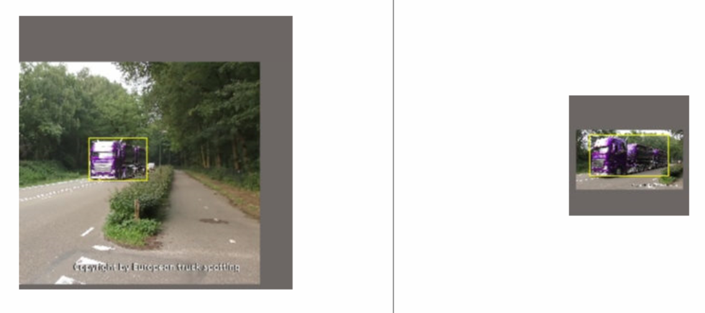
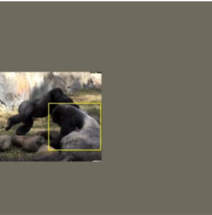
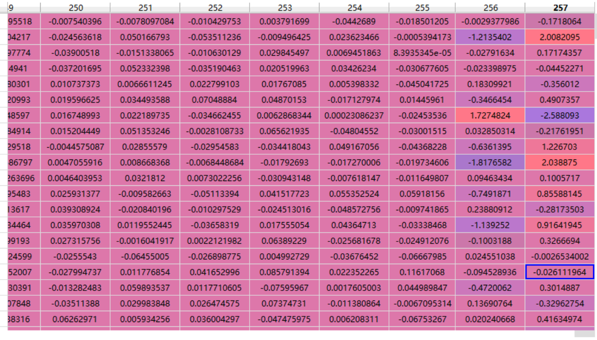

### TODO

- [x] 看训练代码.

- [x] 弄清如何根据目标框裁剪出训练图像的.

- [x] 增加上一帧输入.

- [x] ~~可能有笔误, 后发现是~~我理解错误: scale_curr_ = z_size / sc_

  可视化未见异常：

- [ ] 标注错了？
  sampled_data = self.sampler[item]  # item=2575, 该数字并无作用.  

- [x] 选择上一帧时, 注意如果是第一帧这种特殊情况.

- [x] 把密集对应的测试网络整合到跟踪代码中.

- [x] 不要修改密集对应代码的参数. -> no_grad()

- [ ] 确定密集对应的输入是正确的.

  - 虽然没有用灰度图，但是仍然预测正确。

- [x] 可视化确定密集对应能够预测正确结果.

- [x] 上一帧的gt mask应该是25*25（与basefeature尺寸相同，因为warped mask就是与该特征融合），且应为2d格式。

- [x] 注意负对时标签是否有变化：对上一帧的标签未进行处理，因此没问题。

- [x] 注意生成37*37的标签时，指修改那一个地方行不行。->可是化了，是正确的。

- [x] 把pred mask用上。最简单的方式：直接串接这一通道。

- [x] 写转换层，使得串接了新通道的特征的通道数恢复正常。

- [ ] basemodel中，crop=4，为什么？有何影响？

- [x] 删除detect_anomal

- [ ] make_densebox_target_pre中score_offset = 0了，不是特别严谨，尽管可视化没问题。

- [x] 仔细检查代码。

- [ ] 上一帧于当前帧, 是否应该做同样的平移等变换?如果不做变换, 则上下两帧太近似了, 而测试时往往物体时=是移动的.

- [ ] 受密集对应影响太多了，可能mask值为0/1太大，可以×一个系数；转换为高斯/方向

### 说明

由于是互相关网络, 所以尽量会保证template和target中的目标尺寸相同.

原代码是第一帧与后续帧比, 我们的密集对应要有相邻帧之间比.

测试时, 网络应该有三个输入:

1. 搜索图像
2. 来自第一帧的模板图像
3. 来自上一帧的搜索图像, 以学习密集对应关系

因此, 训练时, 也应该有三个输入, 这样可以避免两帧差距过大难以学习.

相比于原始算法, 我们的方法同时给定上一帧跟踪结果和第一帧跟踪结果, 让网络自行判断要依赖哪种结果.

### 实现细节

对于负对, 只训练密集对应的loss.

注意负对中的search image的标签.

### 如何利用密集对应来变换score map?

#### 方案1

把文献1的跟踪器直接用过来学习密集对应.

可能的问题: 文献1学了密集对应, 但是如何端到端与现有跟踪器集成? 利用密集对应变换heatmap, 然后结合heatmap进行跟踪.

#### 方案2
把文献2中的颜色当作score map可以吗? 问题是, 对于颜色而言, 空间中的每个位置都可以提供有效的监督信号, 而score map的判别性太差了, 大部分位置的值都是0. 其实可以**两者都用**.

### 改进

或许可以串接表示空间坐标的两个通道, 听起来是有用的.

或许可以串接se模块, 自适应决定通道重要性. (可视化, 当warped heatmap质量好时, 权重高,, 否则权重低.)

即用**颜色一致性**的信号监督, 也用heatmap的信号监督.

可以考虑用**循环一致性**监督.

使用SimCLR做数据增强.

或许可以添加non-local信息.

获取可以添加全局箭头引导.

### 参考文献

[1] Learning Correspondence from the Cycle-consistency of Time

[2] [ECCV2018] Tracking Emerges by Colorizing Videos

## 第一次实验结果

性能不好，AO=48.

可能原因：网络过于依赖warped后的得分图，忽略了表观信息。也就是说，网络仅依赖最后两个通道，就能得到较好的结果。

回归不好->训练时给了边框信息。

进一步的原因是上一帧给了**gt**box，太理想了。

解决方案

- 不给边框信息，只给中心点信息。

- 每个点给出方向。

