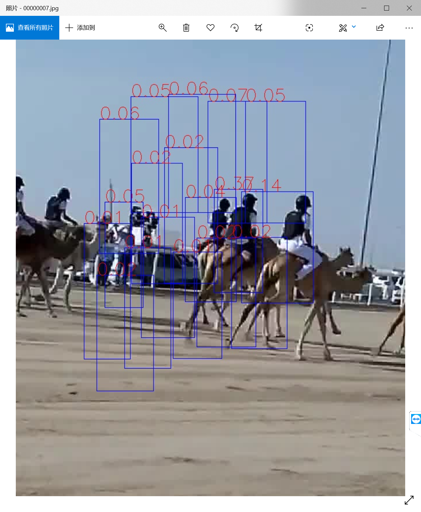
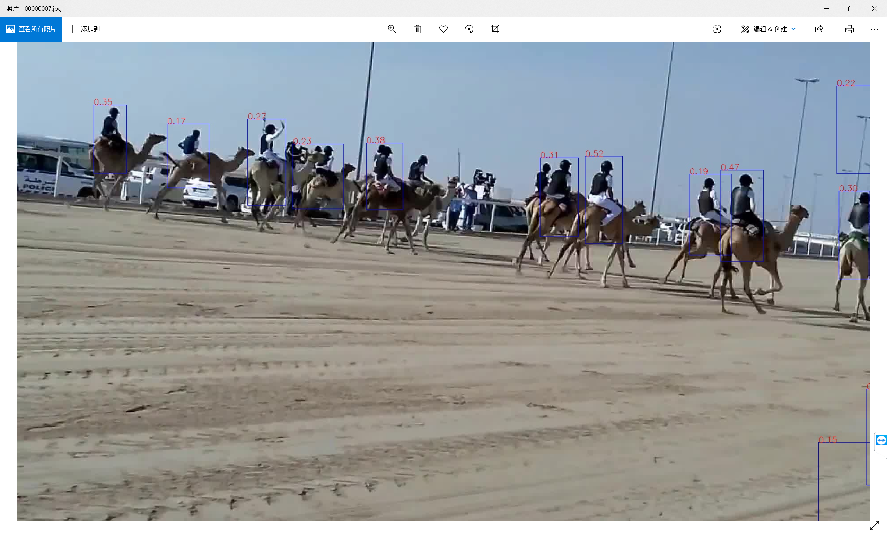
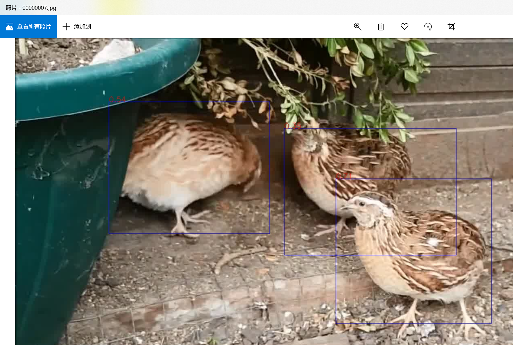
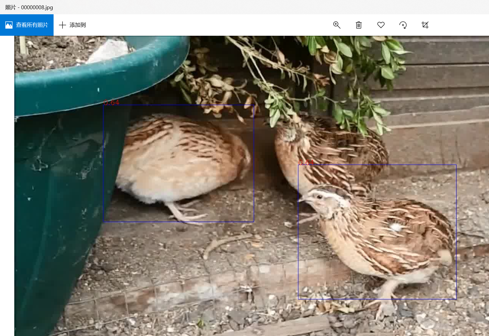
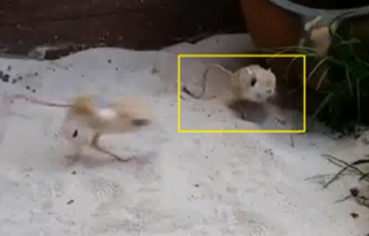
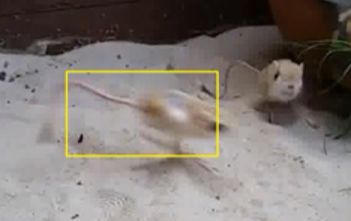
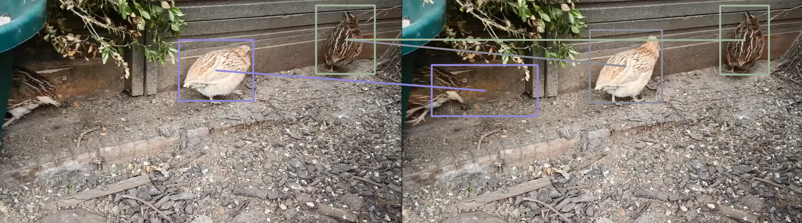
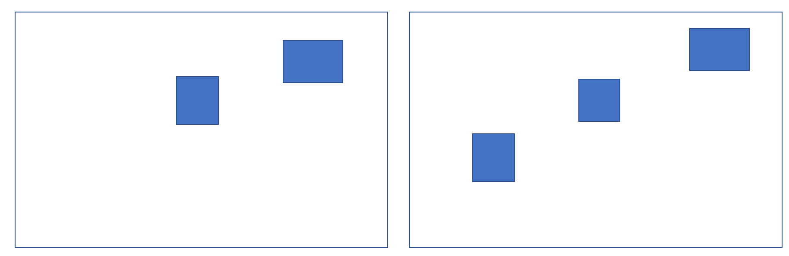
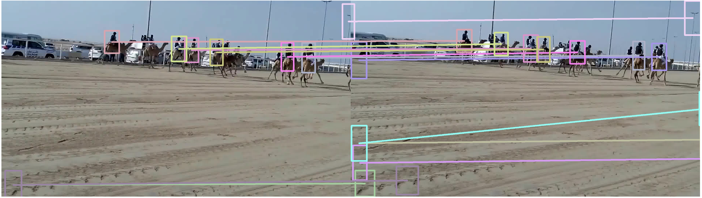
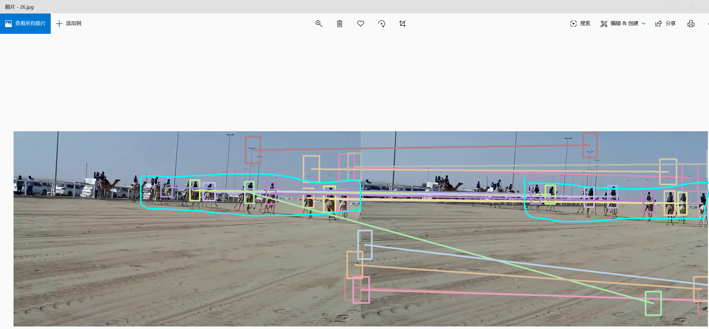

原来的算法：在局部区域内找得分最高的。

- 缺陷：有时会跳到另一个人身上。为什么会跳？

- 

- 上图中，真实目标得分不如另一个人高。注意，此时真实的人已经位于搜索区域的边缘了，中心点没有落到搜索区域中。

- 

- 将搜索区域扩大后，发现真实目标的得分其实是很高的。如果使用大的搜索区域，这段视频根本不会出错。

- 另一种错误情况：

- | 007                                                          | 008                                                          |
  | ------------------------------------------------------------ | ------------------------------------------------------------ |
  |  |  |

  因为根本检测不到，所以必然会跟错。

本质上，跟错的原因，还是目标的得分低了。

# 图匹配算法的初衷

我们设计图匹配算法的初衷，是希望能对以下情况生效：

|                                                              |                                                              |
| ------------------------------------------------------------ | ------------------------------------------------------------ |
|  |  |

假设每帧都能把两个小鼠检测出来，现在的算法仅通过得分选择，可能跳到另一个物体上，但是我们如果能够学到两只小鼠的对应关系，就不会出错了。

**但是这种情况生效的前提是，所有小鼠都被检测出来。**然而，假设检测质量非常好了，现在的跟踪算法就能表现的非常好，图匹配作用非常有限。

# 图匹配算法不能解决的问题

**仅靠中心点，图匹配算法没有理由能对应好**。

可能的方案：不仅依靠中心点，还考虑边框形状。

> 14.jpg

对于上图，说明匹配算法完全不能用。试试看匹配算法能不能在这一帧工作好

圈中的八个人，左边漏检了一个，右边多检测了一个。就算是人，也很难正确判断。

0325：已经得到匹配结果，很多情况下不理想。

# 可能的问题

- 训练损失
- 训练集与测试集不符。
  - 点太多，太密集。30~60个真实点，0~20个噪声点。
  - 我们的任务中，5~20个真实点，0~10个噪声点即可。
- 训练不充分。
  - 百分之七八十的acc，其实是和我们的观测是一致的。
  - 加大batch？改学习率？加大epoch？
- 仅分析一个视频也不好。
- **没有理由说使用图匹配比找最近的框要好**。以前的设想是图匹配在有些边框缺失的条件下也能很好地工作。

可视化训练集。

发现一个训练时的bug，修改后重新训练。

- [ ] 看训练代码如何计算loss，处理outlier。
- [ ] 可视化训练集，简单直观。
- [x] 1.5越界？无影响。
- [ ] 为什么非得都匹配上呢？噪声不处理不行吗？-> 训练时，对于噪声点，怎么处理的（loss怎么计算的）？
- [ ] 训练集肯定有能力识别噪声点的，测试时呢？
- [ ] 想弄懂代码，得先看懂论文吧。
- [ ] 数据点st就不能不一样？
- [x] 为什么数据是几千*几十？可能受batch影响。

# 可能的改进：只匹配一点

现在的问题是，训练数据只能是虚拟的，往往导致与真实情况的分布不同。

另外，现在要求每个点都正确匹配，但是我们不需要。我们希望把目标点匹配上就可以。（以前：所有点都匹配上，现在，一点匹配上。）

受到了Know Your Surroundings: Exploiting Scene Information for Object Tracking的启发，该文并没有各个物体间的对应关系的标签，但是可以进行隐式的学习。

方案：对训练集得到proposal以及对应的正确的框，送到图匹配网络里，进行学习，这样可以保证分布是相同的。训练数据量：10k

如何修改代码