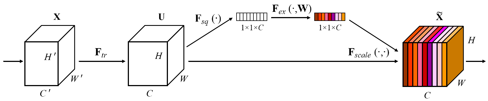
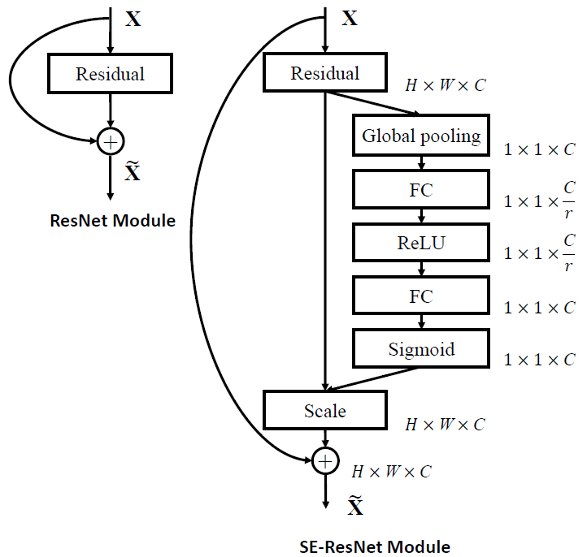
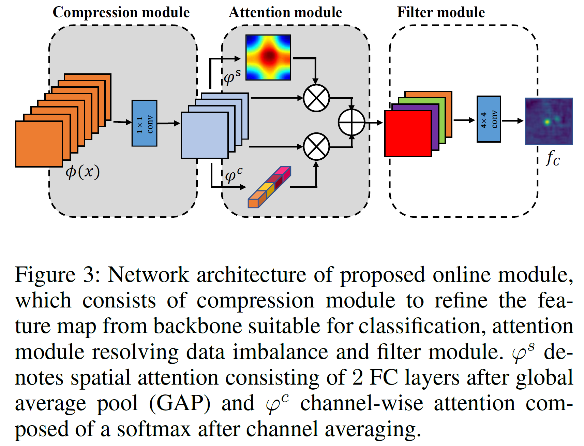
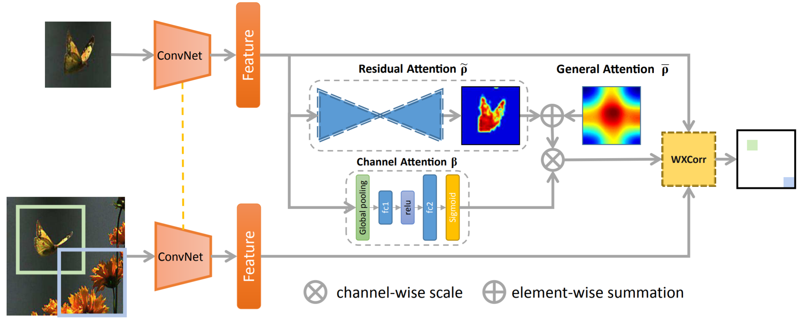

[TOC]

## Related work

### Squeeze-and-Excitation Networks

SE Net：为特征图的每个通道学习重要性。

### Online Learning for Siamese Visual Tracking

#### Target-Aware Deep Tracking

The pre-trained CNN features are agnostic of the semantic and objectness information of the target, which most likely does not appear in the offline training data.

We select a portion of target-specific filters to generate discriminative deep features.

The pretrained feature extractor is offline trained on the classification task and the target-aware part is **only trained in the first frame**.

With the gradients, the feature generation model **selects a fixed number of the filters** with the highest importance scores from the pre-trained CNNs. 为什么梯度反应重要性？梯度是怎么计算的？

At the inference stage, we directly compute the similarity scores between the initial target and the search region in the current frame using the target-aware features.

#### Discriminative and Robust Online Learning for Siamese Visual Tracking

The features provided by siamese matching subnet which are trained offline and set fixed to ensure tracking stabilit and efficiency. However, they’re not target-specific and adaptive to the target’s domain.

Only a few convolutional filters play an important role in constructing each feature pattern or object category.

Note that these 2 modules (gray area) are **only fine-tuned with the first frame** of given sequences and are kept fixed during tracking to ensure stability.

Instead of using the standard stochastic gradient descent (SGD) as the optimization strategy, following (Danelljan et al. 2019), we used Conjugate Gradient Descent better suited for solving quadratic problem in terms of convergence speed.

需要微调的参数包括：compression module 中的 1*1 卷积，和 $\phi^{s}$ 中的 fc 层。注意，本文中的通道 attention 没有参数。

Compression module 减少了特征图的尺寸，相当于改变了预训练网络的结构。这也许不好。

### Channel Attention in Visual Object Tracking

#### Learning Attentions: Residual Attentional Siamese Network for High Performance Online Visual Tracking

仅在离线训练时学习 channel attention，未将其用于在线学习。

虽然看起来和我的 idea 有些相似，但是出发点完全不同，我希望进行更好的 Online learning。

其实你的做法只是把WQ的网络微调了一下。

## Method

将 SE Net 中的模块加入跟踪网络的特征图，利用第一帧仅微调 $F_{sq}$ 和 $F_{ex}$ 中的参数。避免过拟合。

## 问题

这个 idea 是不是太小了？

- 论文 [3] 和我的思路类似，而且我觉得我比他的做法更好。
- 只要有效就行。
- 文章未必只有这一个 idea。

## 参考文献

> [1] Target-Aware Deep Tracking. CVPR 2019.
>
> [2] CSRDCF
>
> [3] Discriminative and Robust Online Learning for Siamese Visual Tracking
>
> [4] Learning Attentions: Residual Attentional Siamese Network for High Performance Online Visual Tracking
>
> [5] NP19
>
> [6] NCA
>
> [7] meta